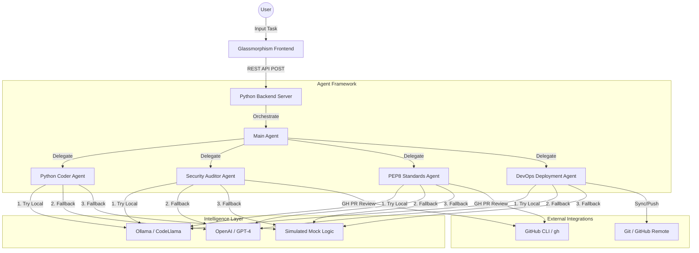

# Multi-Agent Framework Architecture

This document describes the high-level architecture of the intelligent agent system.

## 🏗️ System Overview

The system follows a hierarchical orchestration pattern, where a **Main Agent** manages several specialized agents, each backed by either a local LLM or a cloud-based API.

## 🛠️ Key Components

1.  **Frontend**: A modern, responsive dashboard built with Vanilla HTML/CSS/JS, featuring real-time terminal logging.
2.  **Backend Server**: A zero-dependency Python server handling static file serving and task routing.
3.  **Agents**: Abstracted Python classes that load skills dynamically from Markdown files.
4.  **Local LLM**: Integrated Ollama support for offline, private, and cost-free code analysis.
5.  **GitHub CLI**: Automated Pull Request fetching, diffing, and commenting.
