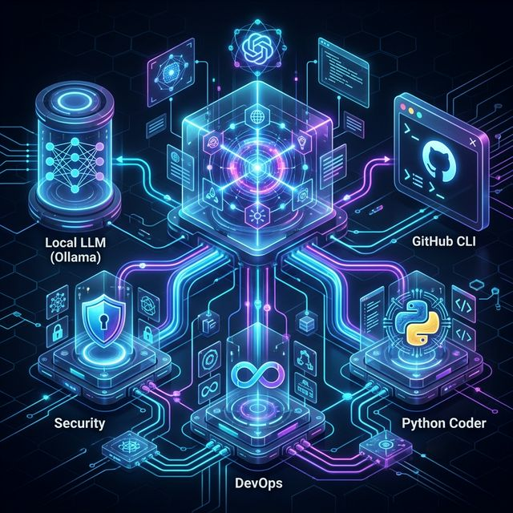

# 🤖 Multi-Agent AI Framework

A powerful, full-stack multi-agent framework designed for secure, autonomous code review and development orchestration.

## 🏗️ Architecture at a Glance
The system utilizes a hierarchical agent model orchestrated by a **Main Agent**. It features:
- **Security Agent**: OWASP-aligned vulnerability auditing.
- **Python Coder**: Autonomous script generation.
- **Standards Agent**: PEP8 and linting compliance.
- **DevOps Agent**: GitHub CLI & Git integration.

For a deep dive into the logic, see [ARCHITECTURE.md](ARCHITECTURE.md).

## 🚀 Features
- **Local-First LLM**: Powered by Ollama (`codellama:7b`) for private, offline reviews.
- **Full-Stack UI**: Sleek glassmorphism dashboard (port 8000).
- **GitHub Integration**: Automated PR reviews via `gh` CLI.
- **Dynamic Skills**: Agents load capabilities from Markdown files.

## 🛠️ Quick Start
1. Install dependencies: `pip install openai` (optional) and install [Ollama](https://ollama.com).
2. Start the backend: `python3 server.py`.
3. Open UI: `http://localhost:8000`.
4. Review PRs: Visit `http://localhost:8000/review.html`.
